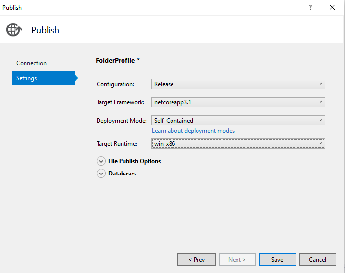
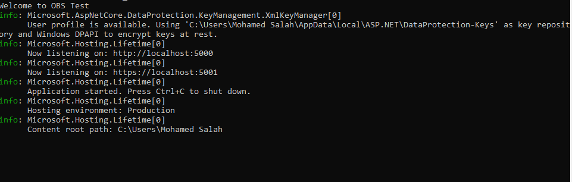
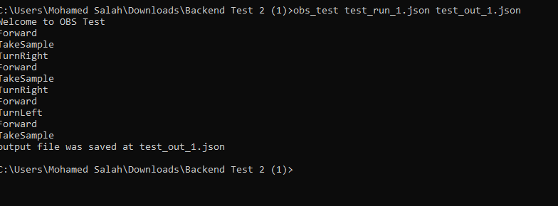
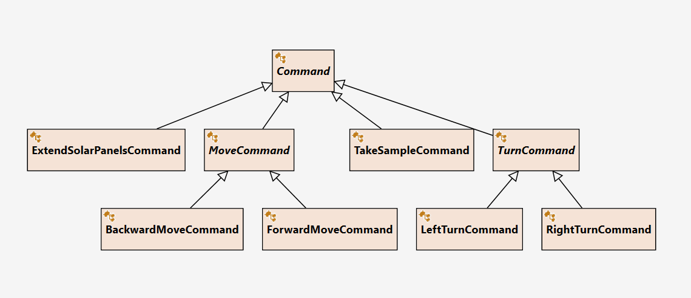

# MarsSurveillanceRobot

Mars Surveillance Robot repository.

This repository has all the developed code to complete assingment for Olympic Channel development department as part of the Backend Developer.


## Technologies
- .netcore 3.1

    #### Why .netCore?
    It has great benefits to create API and at the same time the output is exe so that it can work as a console application
    so from one out, I used it based on the args :
    - if the args are empty app will run the rest API
    - otherwise, it will run as a console app and it will use the arg[0] as input file and arg[1] as output file
    other benefits :
    - has built-in dependency injection
    - has the ability to add custom middleware for exception handling
    
- MSTest 
    For adding unit tests

## How to run 

#### Running obs_test.bat script
go to  **publish** folder that contains the published project
and **obs_test.bat** that script will register the exe file to environment variables so that you can open any terminal and run :

the project was published as self-contained to include all dependencies 
this run for windows platform




command:

    - obs_test for run api 
    postman or similar can be use to test the API

    
    - obs_test <inputfile> <outputfile> for run the app as exe

    
### Log File
    the log files could be found under path 
    
    - Logs/API for API
    - Logs/Console for console 

## Assumption
- the cell contains an infinity number of the same material 
-if the battery is not sufficient for the next move the robot will stop and the result will be returned
-if the robot tried the seven strategies after facing an obstacle and not being able to move the robot will stop and the current status will be returned

## Some design decissions

Given that the main methond will be managed if it will go in direction of console app or API service, 

```
http://localhost:5001/robot
```

## Solution
has two projects
----------------
Project | purpose 
--- | --- |
API|lightweight API layer
Application| contains the business logic 
API.Test| test project for API layer
Application.Test| test project for application layer

  ### note 
    The two test projects are providing samples of unit tests and they are not cover all logic
    this proves that I can write unit tests

# Technical Decision 
for general guid I tried to do the following: 

- Follow the solid prinipal
- Depends on interface not on class construction so in the future the concrete class could be changed easily
- 

### Command
I choose to have on Command parent class and there are 3 types of command
- Move Command include move forward and move backward
- Turn Command include turn left and turn right
- other Command include task sample and extend solar panels



### API
    the post API is
    https://localhost:5001/Robot 
    please note that it is common that POST does not return the result and 
    in case of need to return result it should be Get by Id API to return that 
    but for simplicity I made thePOST return the result

### Console
    I created ProgramForConsole.cs to handle this call for the console app 
    but both console and API use the application layer as both have the same logic


## design pattern

- Factory : for creating the different commands
- Template Method : for focing each command to do the following
    - check battery 
    - check obstacle 
    - Excute the command
    by doing this I go a central place for all commands to be executed 


